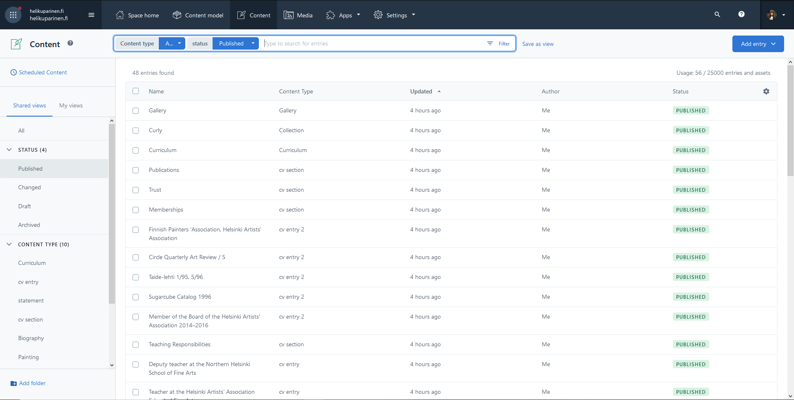

[<- back](./TOC.md)

# Contentful

We use contentful for content managment in this website. All the content in **/about** and **/paintings** is fetched from contentful.

## Content models in this sites contentful space

Our contentful space contains the following models:

1. Biography	- *Bio text for about me page*
2. Collection	- *A collection of paintings.*
3. Curriculum	- *Curriculum vitae.*
4. cv entry	    - *One entry for the cv.*
5. cv entry 2	- *One entry for the cv without a year.*
6. cv section	- *Represent one section in the CV.*
7. Gallery	    - *Gallery, where all the paintigs will be shown*
8. statement	- *Artist's statement.*
9. Post         - *Defines model for a blog post.*

These models should be used in hierarchically like this:

- Biography
- Curriculum - curriculum contains sections
    - cv section - sections contain entries
        - cv entry
        - cv entry 2
- Statement
- Gallery - gallery contains collections
    - Collection
- Post

There should only ever exist one entry of the top level content types so don't add more of those! 

## Adding content to this site

If you want to add something to this site. You must have access to the sites contentful space. First you need an account for that. Head over to https://www.contentful.com/sign-up/ and create an account (you can do it easily with google). Then request me to add you as an collaborator to the sites space.

### Adding content

In the image above, you can see the *Content* tab of our contentful space. Here you can add all the content you want. On the left, you can see all the content types you can modify. Click on something you want to change, for example gallery and the entries found should show only gallery content types. You can then click the entry you want to modify and that should be easy from there!